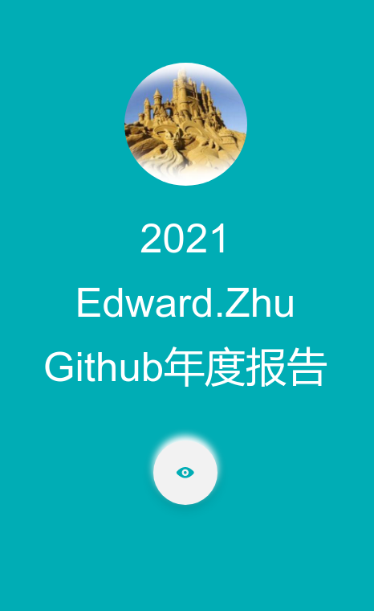
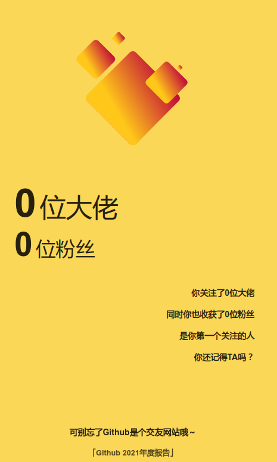
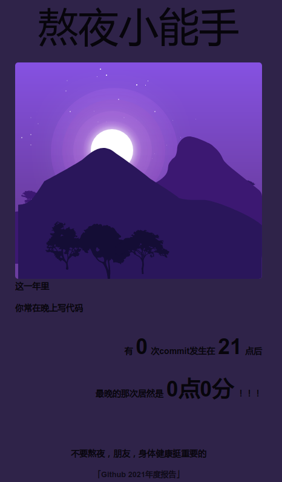
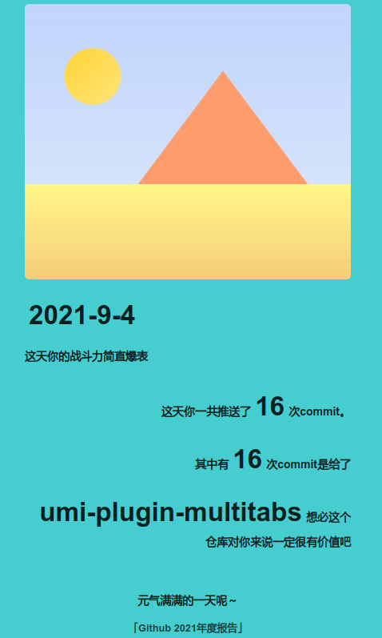
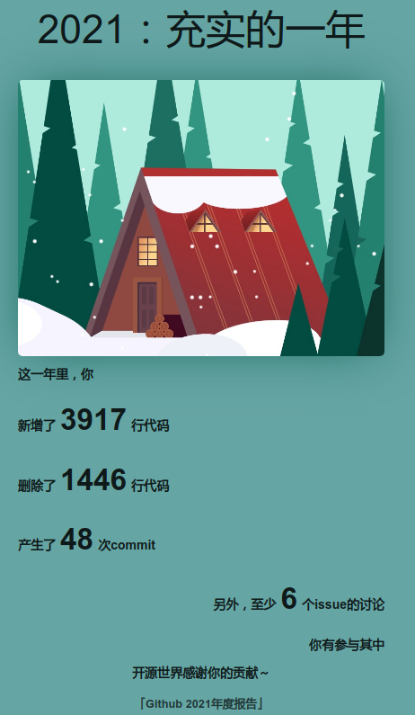

# my annual report

This project use [GitHub API](https://docs.github.com/) to gather user & repos information. So you must add a Personal access tokens to permit access.

You can use https://github.com/settings/tokens to add it.

After got token, you can modify `.env` file under root path. Just add lines like below:

```
access_user=[Your account]
access_token=[Your Token]
```

## Getting Started

Install dependencies,

```bash
$ yarn
```

Start the dev server,

```bash
$ yarn start
```

**Notes**
You must set your browser width less then 500px, because this site is designed for mobile.

## Thanks

This project is come from [github-annual-report](https://github.com/shuiRong/github-annual-report), but it is **NOT** worked now, so I make it work again.

## Snapshots








